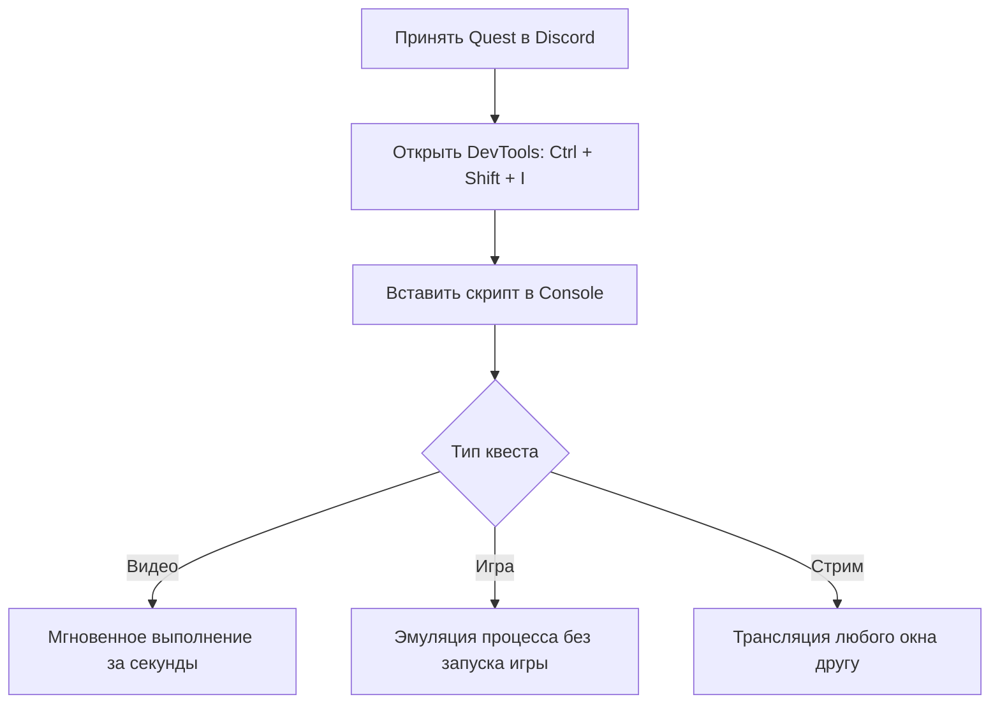

<div align="center">

# 🎮 Discord Quest Completer

### Автоматическое и быстрое выполнение квестов Discord

<p align="center">
  <a href="https://betterdiscord.app/">
    
  </a>
  <a href="#">
    
  </a>
  <a href="#">
    
  </a>
  <a href="#">
    
  </a>
</p>

<p align="center">
  <b>Выполняйте квесты на просмотр видео, запуск игр и стриминг прямо из консоли — без установки самих игр.</b>
</p>

---

</div>

## ✨ Возможности



| Тип задачи | Название | Описание |
| :---: | :--- | :--- |
| 🎬 | **`WATCH_VIDEO`** | Просмотр рекламных трейлеров (выполняется за 5–10 секунд). |
| 🕹️ | **`PLAY_ON_DESKTOP`** | Задание «поиграть в игру 15 минут» — игра подменяется в памяти. |
| 📡 | **`STREAM_ON_DESKTOP`** | Задание «постримить игру другу» — можно включить показ блокнота/браузера. |
| 🎲 | **`PLAY_ACTIVITY`** | Запуск встроенной активности в канале. |

---

## 🚀 Быстрый запуск

### 1️⃣ Подготовка
* Скачайте и установите **[BetterDiscord](https://betterdiscord.app/)**
* Зайдите в **Discord** → **Настройки** ⚙️ → **Склад подарков / Квесты** и нажмите **«Принять»**

### 2️⃣ Открытие консоли
* Нажмите комбинацию клавиш:
  ```
  Ctrl + Shift + I
  ```
* Перейдите во вкладку **Console** *(Консоль)*

### 3️⃣ Запуск

<details>
<summary><b>👇 Нажмите, чтобы скопировать код скрипта</b></summary>

```javascript
delete window.$;
let wpRequire = webpackChunkdiscord_app.push([[Symbol()], {}, r => r]);
webpackChunkdiscord_app.pop();

let ApplicationStreamingStore = Object.values(wpRequire.c).find(x => x?.exports?.A?.__proto__?.getStreamerActiveStreamMetadata).exports.A;
let RunningGameStore = Object.values(wpRequire.c).find(x => x?.exports?.Ay?.getRunningGames).exports.Ay;
let QuestsStore = Object.values(wpRequire.c).find(x => x?.exports?.A?.__proto__?.getQuest).exports.A;
let ChannelStore = Object.values(wpRequire.c).find(x => x?.exports?.A?.__proto__?.getAllThreadsForParent).exports.A;
let GuildChannelStore = Object.values(wpRequire.c).find(x => x?.exports?.Ay?.getSFWDefaultChannel).exports.Ay;
let FluxDispatcher = Object.values(wpRequire.c).find(x => x?.exports?.h?.__proto__?.flushWaitQueue).exports.h;
let api = Object.values(wpRequire.c).find(x => x?.exports?.Bo?.get).exports.Bo;

const supportedTasks = ["WATCH_VIDEO", "PLAY_ON_DESKTOP", "STREAM_ON_DESKTOP", "PLAY_ACTIVITY", "WATCH_VIDEO_ON_MOBILE"];
let quests = [...QuestsStore.quests.values()].filter(x => x.userStatus?.enrolledAt && !x.userStatus?.completedAt && new Date(x.config.expiresAt).getTime() > Date.now() && supportedTasks.find(y => Object.keys((x.config.taskConfig ?? x.config.taskConfigV2).tasks).includes(y)));
let isApp = typeof DiscordNative !== "undefined";

if(quests.length === 0) {
	console.log("You don't have any uncompleted quests!");
} else {
	let doJob = function() {
		const quest = quests.pop();
		if(!quest) return;

		const pid = Math.floor(Math.random() * 30000) + 1000;
		const questName = quest.config.messages.questName;
		const taskConfig = quest.config.taskConfig ?? quest.config.taskConfigV2;
		const taskName = supportedTasks.find(x => taskConfig.tasks[x] != null);
		const taskData = taskConfig.tasks[taskName];
		const applicationId = quest.config.application?.id ?? taskData.applications?.[0]?.id;
		const secondsNeeded = taskData.target;
		let secondsDone = quest.userStatus?.progress?.[taskName]?.value ?? 0;

		if(taskName === "WATCH_VIDEO" || taskName === "WATCH_VIDEO_ON_MOBILE") {
			const speed = 7;
			let completed = false;
			let fn = async () => {			
				while(true) {
					const remaining = Math.min(speed, secondsNeeded - secondsDone);
					await new Promise(resolve => setTimeout(resolve, remaining * 1000));
					const timestamp = secondsDone + speed;
					const res = await api.post({url: `/quests/${quest.id}/video-progress`, body: {timestamp: Math.min(secondsNeeded, timestamp + Math.random())}});
					completed = res.body.completed_at != null;
					secondsDone = Math.min(secondsNeeded, timestamp);
					if(timestamp >= secondsNeeded) break;
				}
				if(!completed) {
					await api.post({url: `/quests/${quest.id}/video-progress`, body: {timestamp: secondsNeeded}});
				}
				console.log("Quest completed!");
				doJob();
			};
			fn();
			console.log(`Spoofing video for ${questName}.`);
		} else if(taskName === "PLAY_ON_DESKTOP") {
			api.get({url: `/applications/public?application_ids=${applicationId}`}).then(res => {
				const appData = res.body[0];
				const exeName = appData.executables?.find(x => x.os === "win32")?.name?.replace(">","") ?? appData.name.replace(/[\/\\:*?"<>|]/g, "");
				const fakeGame = {
					cmdLine: `C:\\Program Files\\${appData.name}\\${exeName}`,
					exeName,
					exePath: `c:/program files/${appData.name.toLowerCase()}/${exeName}`,
					hidden: false,
					isLauncher: false,
					id: applicationId,
					name: appData.name,
					pid: pid,
					pidPath: [pid],
					processName: appData.name,
					start: Date.now(),
				};
				const realGames = RunningGameStore.getRunningGames();
				const fakeGames = [fakeGame];
				const realGetRunningGames = RunningGameStore.getRunningGames;
				const realGetGameForPID = RunningGameStore.getGameForPID;
				RunningGameStore.getRunningGames = () => fakeGames;
				RunningGameStore.getGameForPID = (pid) => fakeGames.find(x => x.pid === pid);
				FluxDispatcher.dispatch({type: "RUNNING_GAMES_CHANGE", removed: realGames, added: [fakeGame], games: fakeGames});
				
				let fn = data => {
					let progress = quest.config.configVersion === 1 ? data.userStatus.streamProgressSeconds : Math.floor(data.userStatus.progress.PLAY_ON_DESKTOP.value);
					console.log(`Quest progress: ${progress}/${secondsNeeded}`);
					if(progress >= secondsNeeded) {
						console.log("Quest completed!");
						RunningGameStore.getRunningGames = realGetRunningGames;
						RunningGameStore.getGameForPID = realGetGameForPID;
						FluxDispatcher.dispatch({type: "RUNNING_GAMES_CHANGE", removed: [fakeGame], added: [], games: []});
						FluxDispatcher.unsubscribe("QUESTS_SEND_HEARTBEAT_SUCCESS", fn);
						doJob();
					}
				};
				FluxDispatcher.subscribe("QUESTS_SEND_HEARTBEAT_SUCCESS", fn);
				console.log(`Spoofed your game to ${appData.name}. Wait for ${Math.ceil((secondsNeeded - secondsDone) / 60)} more minutes.`);
			});
		} else if(taskName === "STREAM_ON_DESKTOP") {
			let realFunc = ApplicationStreamingStore.getStreamerActiveStreamMetadata;
			ApplicationStreamingStore.getStreamerActiveStreamMetadata = () => ({
				id: applicationId,
				pid,
				sourceName: null
			});
			let fn = data => {
				let progress = quest.config.configVersion === 1 ? data.userStatus.streamProgressSeconds : Math.floor(data.userStatus.progress.STREAM_ON_DESKTOP.value);
				console.log(`Quest progress: ${progress}/${secondsNeeded}`);
				if(progress >= secondsNeeded) {
					console.log("Quest completed!");
					ApplicationStreamingStore.getStreamerActiveStreamMetadata = realFunc;
					FluxDispatcher.unsubscribe("QUESTS_SEND_HEARTBEAT_SUCCESS", fn);
					doJob();
				}
			};
			FluxDispatcher.subscribe("QUESTS_SEND_HEARTBEAT_SUCCESS", fn);
			console.log(`Spoofed your stream to the target game. Stream any window in vc for ${Math.ceil((secondsNeeded - secondsDone) / 60)} more minutes.`);
			console.log("Remember that you need at least 1 other person to be in the vc!");
		} else if(taskName === "PLAY_ACTIVITY") {
			const channelId = ChannelStore.getSortedPrivateChannels()[0]?.id ?? Object.values(GuildChannelStore.getAllGuilds()).find(x => x != null && x.VOCAL.length > 0).VOCAL[0].channel.id;
			const streamKey = `call:${channelId}:1`;
			let fn = async () => {
				console.log("Completing quest", questName, "-", quest.config.messages.questName);
				while(true) {
					const res = await api.post({url: `/quests/${quest.id}/heartbeat`, body: {stream_key: streamKey, terminal: false}});
					const progress = res.body.progress.PLAY_ACTIVITY.value;
					console.log(`Quest progress: ${progress}/${secondsNeeded}`);
					await new Promise(resolve => setTimeout(resolve, 20 * 1000));
					if(progress >= secondsNeeded) {
						await api.post({url: `/quests/${quest.id}/heartbeat`, body: {stream_key: streamKey, terminal: true}});
						break;
					}
				}
				console.log("Quest completed!");
				doJob();
			};
			fn();
		}
	};
	doJob();
}
```

</details>

---

## 📌 Важные примечания

> [!IMPORTANT]
> **Для квестов со стримом:** в голосовом канале обязательно должен находиться **как минимум 1 зритель** (друг или второй аккаунт).

> [!TIP]
> Время выполнения квестов на игру (15 минут) нельзя сократить, так как сервер проверяет тайминги. Скрипт будет работать в фоне — просто не закрывайте Discord.

---

<div align="center">
  <sub></sub>
</div>
